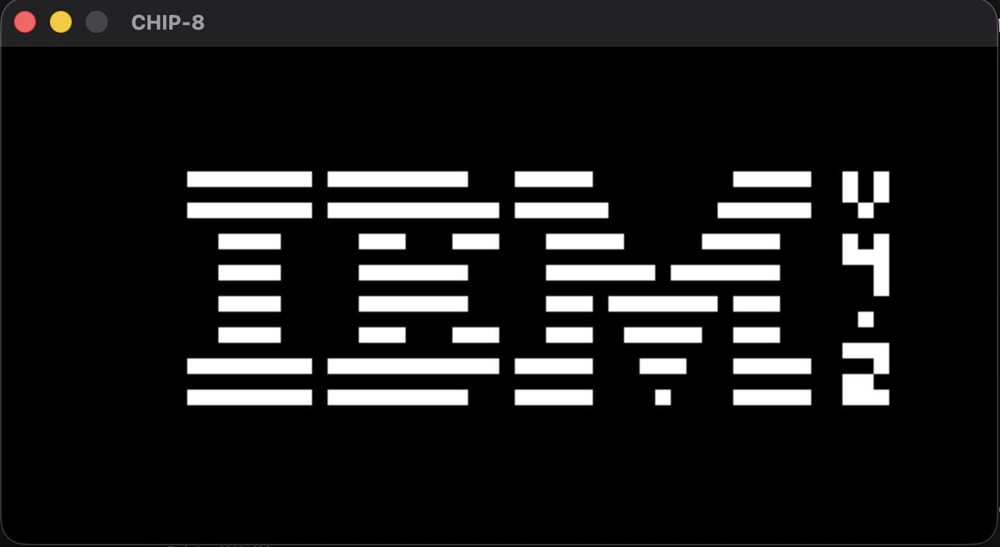
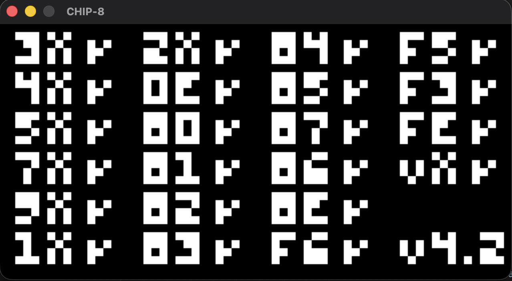
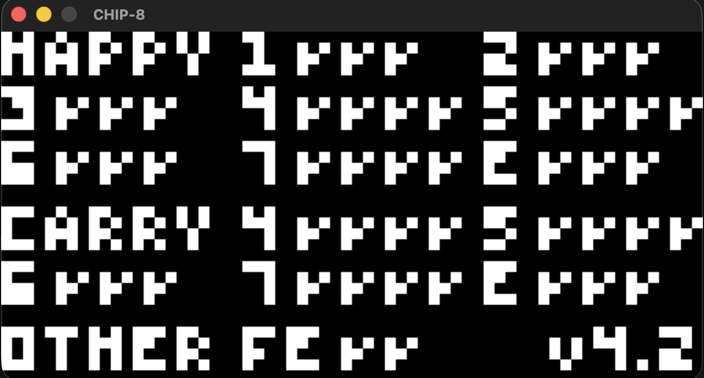
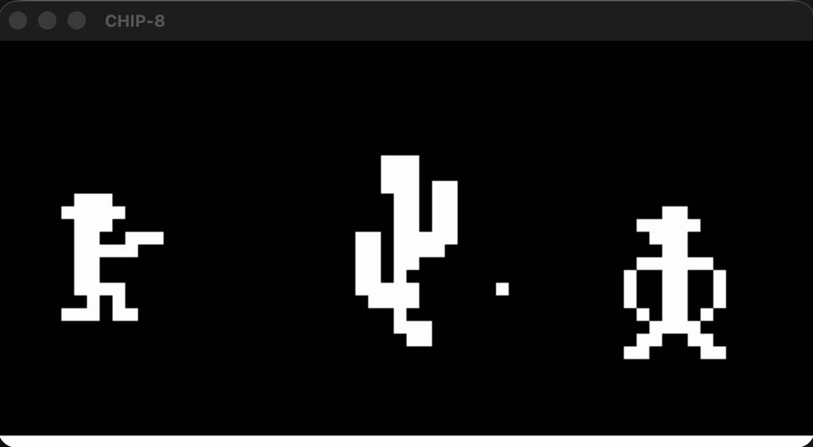

# CHIP-8 Emulator

A CHIP-8 interpreter written in C++17 with SDL2. It implements the complete CHIP-8 instruction set, runs classic and modern CHIP-8 programs, passes the [Timendus CHIP-8 test suite](https://github.com/Timendus/chip8-test-suite), and compiles to WebAssembly so it can be played in the browser.

**[▶ Play it in your browser](https://parth06p.github.io/chip8-emulator/play/)**



## Features

- All 35 CHIP-8 instructions
- 64×32 monochrome display with XOR sprite drawing and collision detection
- Delay and sound timers counting down at 60 Hz
- Keyboard input mapped to the 16-key hex keypad
- Square-wave beep driven by the sound timer
- Configurable compatibility quirks, with a `--classic` preset for original 1970s programs
- Emulator core built as a separate library with no SDL dependency
- Native desktop build and a WebAssembly build from the same source code

## Test results

Passes the Corax+ opcode test, the flags test, the keypad test, and the quirks test (classic mode, except display wait; see [Known limitations](#known-limitations)).

| Corax+ opcode test | Flags test |
|---|---|
|  |  |

|Gameplay|


## Building

### Desktop

Requires a C++17 compiler and CMake 3.16 or newer. SDL2 is downloaded and built automatically by CMake, so there's nothing else to install.

```bash
git clone git@github.com:parth06p/chip8-emulator.git
cd chip8-emulator
cmake -B build
cmake --build build
```

The first configure takes a few minutes while SDL2 builds. Developed and tested on macOS (Apple Silicon).

### Web (WebAssembly)

Requires [Emscripten](https://emscripten.org/). The web build uses Emscripten's own SDL2 port and bundles the ROMs in `web-roms/` into the page.

```bash
emcmake cmake -B build-web
cmake --build build-web
cd build-web
python3 -m http.server 8000
```

Then open `http://localhost:8000/chip8.html`. Pages must be served over HTTP rather than opened directly from disk, because browsers block local file access.

## Usage

```bash
./build/chip8 <rom file> [--classic]
```

- Without flags, the emulator uses modern behaviour, which suits most programs written in the last few decades.
- `--classic` switches to the behaviour of the original COSMAC VIP interpreter, needed by many games from the 1970s.

Example:

```bash
./build/chip8 roms/3-corax+.ch8
```

The web version starts *Outlaw* by default.

## Controls

The CHIP-8 hex keypad is mapped onto the left side of the keyboard:

```
CHIP-8 keypad        Keyboard
 1  2  3  C           1  2  3  4
 4  5  6  D    →      Q  W  E  R
 7  8  9  E           A  S  D  F
 A  0  B  F           Z  X  C  V
```

- **Backspace:** restart the current program
- **Esc:** quit (desktop)

In the browser, click the game first to give it keyboard focus. Sound starts after the first interaction, because browsers block audio until then.

## Architecture

```
src/
├── core/        Chip8 class: memory, registers, stack, timers, display, instruction execution
└── frontend/    SDL2 window, rendering, keyboard input, audio, main loop
```

The core is compiled as a standalone library and knows nothing about SDL. The frontend runs one frame at a time: it handles input, executes about 11 instructions (roughly 700 per second), ticks the timers, updates the audio, and draws the display.

That frame logic lives in a single `frame()` function. On the desktop, `main` calls it in a loop at about 60 frames per second. In the browser, a program can't run its own endless loop without freezing the tab, so Emscripten registers `frame()` with the browser's animation loop instead. Everything else is shared between the two builds.

Keeping the core independent of any graphics library means it can be tested in isolation and reused elsewhere, for example as a headless environment for reinforcement learning.

## Compatibility quirks

Several instructions behaved differently on the original interpreter than on later ones. Each difference is a setting in the `Quirks` struct:

| Quirk | Classic | Modern |
|---|---|---|
| `8XY1`/`8XY2`/`8XY3` reset `VF` to 0 | on | off |
| `8XY6`/`8XYE` shift `VY` into `VX` | on | off |
| `FX55`/`FX65` increment `I` | on | off |
| `BNNN` jumps using `VX` instead of `V0` | off | off |

## Challenges and decisions

- **Flag-register ordering.** Arithmetic instructions compute their flag from the original operands, write the result to `VX`, and write `VF` last. This keeps results correct when `VF` itself is an operand, which the flags test checks.
- **Sprite wrapping versus clipping.** A sprite's starting position wraps around the screen, but pixels that run past the edge are clipped rather than wrapped.
- **Waiting for input without freezing.** `FX0A` waits for a key to be pressed *and released*. It does this by rewinding the program counter so the instruction re-runs each cycle, which keeps the window responsive while the program waits.
- **A real-game bug traced to quirks.** An original 1970s game left stray pixels on screen. The cause was that it relied on the original interpreter's behaviour for register loads and shifts. Rather than hard-coding one behaviour, I made the quirks configurable so both classic and modern programs run correctly.
- **Porting to the browser.** Browsers don't allow a blocking main loop, so I restructured the game loop into a per-frame function that the desktop build calls in a loop and the browser calls on each animation frame. The emulator core needed no changes.

## Known limitations

- The display-wait quirk (limiting sprite drawing to once per frame) is not implemented, so some original games may run slightly fast or flicker.
- SUPER-CHIP and XO-CHIP extensions are not supported.
- The web version needs a physical keyboard.

## Acknowledgements

- [Timendus CHIP-8 test suite](https://github.com/Timendus/chip8-test-suite) for test ROMs
- [Tobias V. Langhoff's guide to making a CHIP-8 emulator](https://tobiasvl.github.io/blog/write-a-chip-8-emulator/)
- [CHIP-8 Archive](https://johnearnest.github.io/chip8Archive/) for freely licensed games, including *Outlaw* by John Earnest, used in the web demo
- [Emscripten](https://emscripten.org/) for the WebAssembly toolchain

## License

MIT